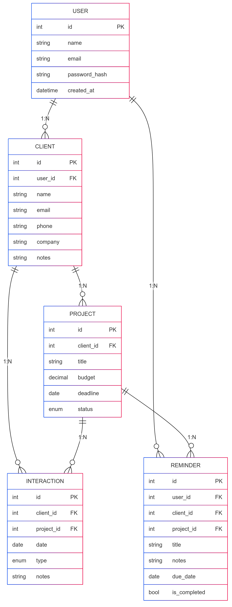
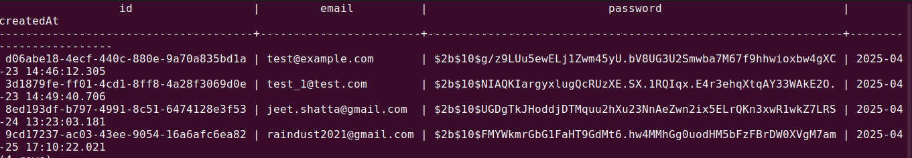

# MiniCRM

A simple CRM (Customer Relationship Management) system where users can manage their **clients** and their **projects** easily.

---

## 🛠 Tech Stack Used

- **Backend**: Node.js, Express.js
- **Database**: PostgreSQL
- **ORM/Query Builder**: Sequelize / Knex (depending on your setup)
- **Authentication**: JWT / bcrypt (for password hashing)
- **Hosting/Deployment**: Localhost (can be deployed to Render / Railway)

---

## 🚀 Setup Instructions

1. **Clone the repository**:
   ```bash
   git clone <your-repo-link>
   cd minicrm
   ```

2. **Install dependencies**:
   ```bash
   npm install
   ```

3. **Configure the database**:  
   Set up PostgreSQL and create a database (e.g., `minicrm`).  
   Update your `.env` file with correct credentials:
   ```bash
   DB_USER=postgres
   DB_PASSWORD=yourpassword
   DB_HOST=localhost
   DB_PORT=5432
   DB_DATABASE=minicrm
   JWT_SECRET=your_jwt_secret
   ```

4. **Run database migrations** (if any):
   ```bash
   npm run migrate
   ```

5. **Start the server**:
   ```bash
   npm run dev
   ```

---

## 🗺 ERD (Entity Relationship Diagram)

Here is the ERD representing the database relationships:



---

## ✨ Summary of Approach and Decisions

- **Authentication**: Only registered users (Admins) can log in and manage their own clients and projects.
- **Clients**: 
  - Each user can create, update, delete, and view their **own clients**.
  - Clients have **required fields**: `name`, `email`, `phone`.
  - Clients have **optional fields**: `company`, `notes`.
- **Projects**: 
  - A **Project** is always linked to a **Client**.
  - Projects include `title`, `budget`, `deadline`, and `status`.
  - Projects also support full CRUD operations.
- **Separation**: 
  - No separate client login needed. 
  - Only system users (admins) log in and manage clients and projects.
- **Password Security**:
  - Passwords are stored as **hashed values** using **bcrypt**.

---

## 🧪 Sample Test Users

You can use one of the following test users to log in:

| Email                      | Password (encrypted in DB) |
|-----------------------------|-----------------------------|
| test@example.com            | *(password hashed)*         |
| test_1@test.com             | *(password hashed)*         |
| jeet.shatta@gmail.com       | *(password hashed)*         |
| raindust2021@gmail.com      | *(password hashed)*         |

> **Note**: Since passwords are hashed, you can either manually insert a known user/password via API or create a new user via the signup flow.

Sample database users:



---

# 📄 Conclusion

MiniCRM allows managing clients and projects efficiently with a clear, structured backend and strong database relationships.  
Perfect for small businesses or freelancers to track client projects without overhead.

